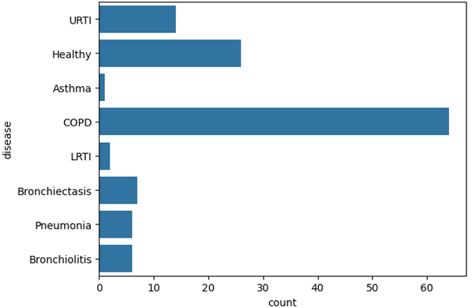
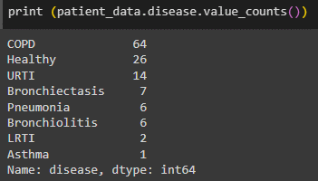
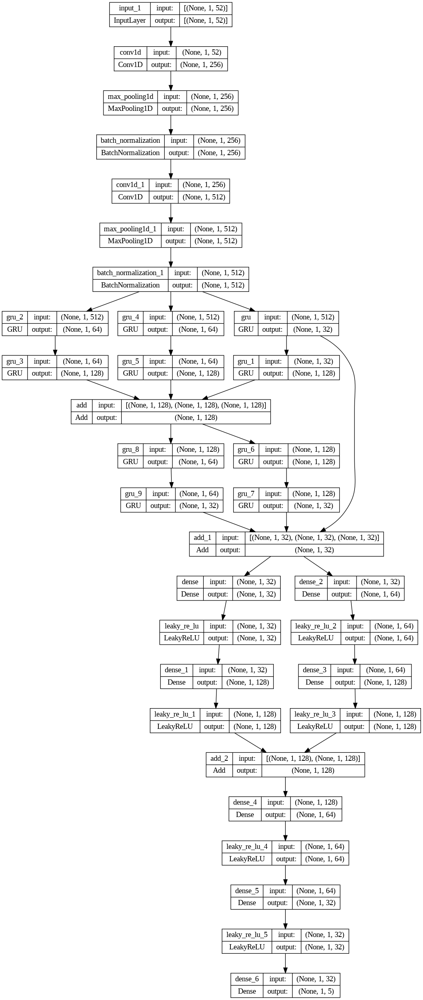
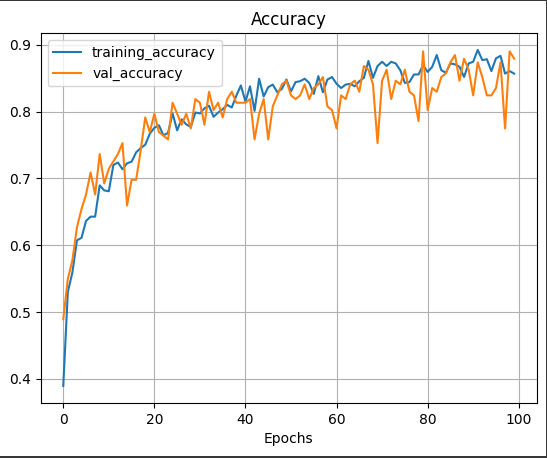
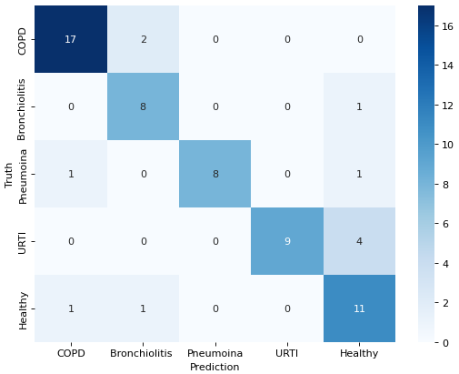
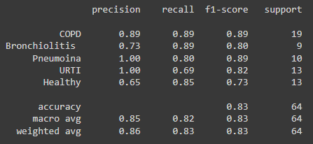

Respiratory disease classification
===
#### Автор:  Айбатуллин Марат

### Установка

#### Требования:
- Python
- Google Colab

### Датасет:
| Датасет | Скачать |
| ---     | ---   |
| Respiratory Sound Database | [Скачать](https://www.kaggle.com/datasets/vbookshelf/respiratory-sound-database/download?datasetVersionNumber=2) |

### Чтобы установить:
1. Скачайте файл или сделайте git-клонирование
2. Откройте Google Colab
3.	Загрузите датасет в диск и измените пути до датасета
4. Запустите все ячейки

## Описание проекта
Тема исследовательской работы: Распознавание респираторных заболеваний по аудиозаписи звука дыхания.

Цель данного исследовательского проекта состоит в разработке и обучении модели машинного обучения для распознавания респираторных заболеваний по аудиозаписям звука дыхания. Дыхание является важным индикатором состояния дыхательной системы, и его звуковые характеристики могут содержать информацию о различных заболеваниях, таких как астма, бронхит, пневмония и другие.

Для достижения поставленной цели будет использована база данных respiratory sound database, содержащая аудиозаписи звуков дыхания, собранные с помощью электронной стетоскопии. Эта база данных представляет собой ценный набор данных, который позволяет анализировать различные аспекты звукового сигнала, связанные с респираторными заболеваниями.

## Разведочный анализ
База данных звуков дыхания была создана двумя исследовательскими группами в Португалии и Греции. Она включает 920 аннотированных записей различной продолжительности - от 10 до 90 секунд. Эти записи были взяты у 126 пациентов. Данные включают как чистые звуки дыхания, так и записи с шумом, имитирующие реальные условия жизни. Пациенты охватывают все возрастные группы - детей, взрослых и пожилых людей.
Этот набор данных Kaggle включает в себя:
•	920 звуковых файлов .wav
•	920 файлов аннотаций .txt
•	Текстовый файл с указанием диагноза для каждого пациента
•	Текстовый файл, объясняющий формат именования файлов
•	Текстовый файл со списком 91 имени
•	Текстовый файл, содержащий демографическую информацию о каждом пациенте

Файл демографической информации содержит 6 столбцов:
- Номер пациента
- Возраст
- Пол
- ИМТ взрослого (кг/м2)
- Вес ребенка (кг)
- Рост ребенка (см)

Имя каждого аудиофайла разделено на 5 элементов, разделенных символами подчеркивания (_).

1.	Номер пациента (101, 102, ..., 226)
2.	Индекс записи
3.	Расположение грудной клетки 
a.	Трахея (Tc)
b.	Передний левый (Al)
c.	Передний правый (Ar)
d.	Задний левый (Pl)
e.	Задний правый (Pr)
f.	Боковой левый (Ll)
g.	Боковой правый (Lr)
4.	Режим сбора данных
a.	последовательный/одноканальный (sc),
b.	одновременный/многоканальный (mc)
5.	Записывающее оборудование
a.	Микрофон AKG C417L (AKG C417L),
b.	Стетоскоп 3M Littmann Classic II SE (LittC2SE),
c.	Электронный стетоскоп 3M Littmann 3200 (Lite 3200),
d.	Электронный стетоскоп d. Welch Allyn Meditron Master Elite (Медитрон)
Текстовые файлы аннотаций состоят из четырех столбцов:
•	Начало дыхательного цикла(ов)
•	Конец дыхательного цикла(ов)
•	Наличие/отсутствие хрипов (наличие=1, отсутствие=0)
•	Наличие/отсутствие хрипов (наличие=1, отсутствие=0)

В диагностическом файле используются следующие сокращения:
•	COPD: Хроническая обструктивная болезнь легких
•	LRTI: Инфекция нижних дыхательных путей
•	URTI: Инфекция верхних дыхательных путей

По диаграмме ниже видно, что наибольшее количество записей больных с COPD, а наименьшее Asthma и LRTI.

## Подготовка данных
### Анализ требований к данным
Данная работа по анализу звуковых данных связана с диагностикой респираторных заболеваний на основе аудиофайлов. Требуется подготовить данные для обучения модели, способной классифицировать звуковые записи на основе характеристик звуковых сигналов.

### Получение данных
Аудиофайлы предоставлены в формате WAV и располагаются в определенной директории audio_data. Для дополнительной информации о пациентах используется файл patient_data.csv.

### Предварительный анализ данных
Первоначально был проанализирован файл patient_data.csv, содержащий информацию о пациентах и их диагнозах. Этот файл был загружен в DataFrame diagnosis_df, где было проанализировано распределение диагнозов по категориям заболеваний.

### Предобработка данных
Для подготовки данных к обучению модели была разработана функция mfccs_feature_exteraction(dir_). Эта функция выполняет следующие шаги:
1.	Проходит по аудиофайлам в указанной директории.
2.	Извлекает аудиоданные с использованием библиотеки librosa.
3.	Для каждого аудиофайла извлекает признаки MFCC (Mel-frequency cepstral coefficients).
4.	Для пациентов с диагнозом COPD извлекаются только два образца, чтобы уравновесить классы, в противном случае берутся различные аугментации данных, такие как добавление шума, сдвиг и растяжение звука.
5.	Извлеченные признаки MFCC добавляются в массив X_, а соответствующие метки добавляются в массив y_.
В результате работы функции получаются массивы X_data и y_data, содержащие предобработанные данные для обучения модели.

### Представление данных
Полученные признаки MFCC представлены в виде массивов x_mfccs, а метки классов - в массиве y. Для дальнейшего обучения модели метки классов были закодированы в формате one-hot encoding.

### Разделение данных
Для обучения, валидации и тестирования модели данные были разделены на тренировочный, валидационный и тестовый наборы с помощью функции train_test_split. После этого данные были подготовлены для использования в моделировании.

## Моделирование
### Выбор модели
В данной работе была выбрана модель, объединяющая в себе сверточные нейронные сети (CNN) и рекуррентные нейронные сети (GRU). Этот выбор обусловлен необходимостью анализа последовательных данных, характерных для аудиозаписей, и выявления зависимостей между ними.

### Архитектура модели
Архитектура модели GRU-CNN включает в себя следующие шаги:
1.	Сначала входные данные проходят через слои сверточной нейронной сети (Conv1D) для извлечения признаков из аудио-спектрограммы.
2.	Далее результаты проходят через слои GRU для анализа последовательных зависимостей.
3.	Используются слои объединения (Pooling1D) для уменьшения размерности и повышения вычислительной эффективности.
4.	Для улучшения обобщающей способности модели используются слои пакетной нормализации (BatchNormalization).
5.	Для объединения информации из разных ветвей GRU используются слои слияния (add).
6.	Далее идут несколько слоев полносвязных нейронных сетей с функцией активации LeakyReLU для классификации аудиозаписей на различные категории.

 
 
### Компиляция и обучение модели
После построения модели были выбраны функция потерь, оптимизатор и метрики. В качестве функции потерь была выбрана категориальная перекрестная энтропия (categorical_crossentropy), а в качестве оптимизатора - алгоритм Adam с низкой скоростью обучения (learning rate = 0.0001). Метрикой для оценки производительности модели была выбрана точность (accuracy).
  
## Оценка

Модель GRU-CNN была оценена на тестовом наборе данных для проверки ее способности классифицировать аудиозаписи на различные категории звуковых паттернов. Для этого были проведены следующие шаги:
1.	Кривые потерь и точности: Для оценки обучения модели и предотвращения переобучения были построены графики изменения потерь и точности на тренировочных и валидационных данных. Это позволяет оценить степень обучения модели и ее способность обобщать на новые данные.

2.	Матрица ошибок: Была построена матрица ошибок (confusion matrix), которая позволяет оценить производительность модели по классам. Матрица ошибок показывает количество верных и неверных классификаций для каждой из категорий.
 

3.	Метрики классификации: Для каждого класса были вычислены метрики precision, recall и F1-score. Эти метрики позволяют оценить качество классификации для каждой из категорий звуковых записей.

 
4.	Прогнозирование на новых данных: Была реализована функция для прогнозирования на новых данных, которая принимает аудиофайл, извлекает признаки MFCC и применяет к ним обученную модель для предсказания категории звуковой записи. Это позволяет оценить работоспособность модели в реальном времени на новых данных.

### Результаты оценки

Исходя из матрицы ошибок и метрик классификации, можно сделать следующие выводы о производительности модели:

* Модель демонстрирует хорошую точность в предсказании классов "COPD" и "Pneumoina", где precision составляет 0.89 и 1.00 соответственно. Это означает, что большинство объектов, которые модель отнесла к этим классам, действительно принадлежат им. Однако, стоит отметить, что для класса "Pneumoina" recall составляет 0.80, что может указывать на некоторые пропущенные случаи этого класса.

* МДля класса "Bronchiolitis" модель показывает хорошие результаты по метрикам precision и recall (0.73 и 0.89 соответственно), что свидетельствует о том, что модель хорошо определяет объекты этого класса.

* ММодель имеет высокий recall для класса "Healthy" (0.85), что означает, что большинство объектов этого класса были корректно определены. Однако, precision для этого класса ниже, что может указывать на некоторое количество ложноположительных результатов.

* Для класса "URTI" модель показывает идеальную точность (precision = 1.00), но низкий recall (0.69), что может свидетельствовать о том, что модель недооценивает количество объектов этого класса.

По результатам оценки модели GRU-CNN показала высокую точность и способность различать различные категории звуковых записей. Кривые потерь и точности показали, что модель успешно обучалась и не переобучалась на тренировочных данных. ` Общая точность модели составляет 0.83 `, что подтверждает ее способность правильно классифицировать объекты в целом. Однако, следует обратить внимание на некоторые дисбалансы в производительности модели для отдельных классов, такие как низкий recall для класса "URTI" и невысокая precision для класса "Healthy".
